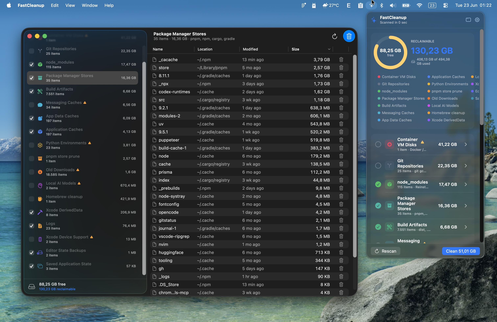

# FastCleanup

A native macOS **menu-bar** app for scanning and reclaiming disk space — fast,
private, and built entirely in Swift. It lives in the top-right menu bar (no Dock
icon), finds gigabytes of safe-to-remove caches, build artifacts, and junk, and
shows it all as charts before you clean a thing.

<p align="center">
  
</p>

> Real scan above: **130 GB reclaimable** surfaced across 18 categories, with the
> native results window open on Package Manager Stores.

## Download

Grab the latest signed & notarized installer from
**[Releases](https://github.com/layatai/fastcleanup/releases/latest)** →
`FastCleanup-1.1.dmg`. Drag **FastCleanup** to Applications, launch it, and the
✨ icon appears in your menu bar. It's notarized by Apple, so it opens
warning-free. Requires **macOS 14+**.

## Features

- **🔍 Concurrent scan engine** — parallel directory enumeration (`TaskGroup`)
  with allocated-size accounting; cancellable, with live per-category progress.
- **🪟 Two ways to work** — a compact **menu-bar popover** (now **drag-to-resize**
  from the corner grip; your size is remembered), or a full **native results
  window** with a category sidebar and a sortable, multi-select table (Name ·
  Location · Modified · Size). The window only appears on demand — no Dock icon
  until you open it.
- **🧭 Location-aware rows** — every item shows *where* it lives, so you can tell
  ten different `node_modules` apart before removing them.
- **📊 Charts & statistics** — a disk-usage **ring gauge** (free/used, color-coded
  by pressure: green → orange → red) and a Swift Charts **donut** of reclaimable
  space broken down by category.
- **🧮 Many disjoint categories** — no double-counting; see the table below.
- **✅ Safe by default** — only safe, regenerable categories are pre-selected.
  Caution items (AI models, messaging caches, container VMs) are unchecked until
  you opt in.
- **🗑️ Reversible cleanup** — everything **moves to the Trash** by default and can
  be recovered. Permanent delete is an opt-in toggle in Settings.
- **🛠️ Command-based cleanups** — beyond trashing files, FastCleanup can run the
  tools' own reclaimers — `brew cleanup`, `docker … prune`, `pnpm store prune` —
  each shown only when the tool is installed, and opt-in (never auto-selected).
- **🧬 node_modules dedupe (non-destructive)** — when `fclones` is installed on an
  APFS volume, *Optimize node_modules (dedupe)* replaces identical files across your
  `node_modules` trees with copy-on-write **clones**, reclaiming space while the
  projects keep working. (Tip: `pnpm` prevents the duplication structurally.)
  Don't have `fclones`? A one-click **Install** banner appears (runs
  `brew install fclones`); or install it yourself with `brew install fclones`
  (or `cargo install fclones`).
- **🔓 In-use aware** — files a running app has locked (e.g. a browser's cache while
  it's open) are reported as "*N in use — quit the app & rescan*" instead of being
  silently skipped, so the freed total never lies.
- **🌿 Git-aware** — large `.git` repos are compacted with `git gc` (repacks
  history, reclaims loose objects) **without losing a single commit** — never
  deleted.
- **🖱️ Right-click context menus** — on any file or category:
  **Open** · **Reveal in Finder** · **Copy Path / Name / Size** ·
  **Move to Trash** (per item) · **Clean / Compact** (per category).
  Double-click a file to reveal it in Finder.
- **🔒 Private & native** — pure Swift/SwiftUI, no telemetry, no Electron, no
  network calls. The whole signed app is ~640 KB.

## What it scans

| Category | What it targets | Default |
|---|---|---|
| **Application Caches** | `~/Library/Caches` (pip, JetBrains, browsers, `*-updater`…) | ✅ |
| **Editor State Backups** | Stale `*.vscdb.backup` in Cursor / VS Code globalStorage (live DB kept) | ✅ |
| **App Data Caches** | Electron caches inside Cursor, Claude, VS Code, etc. | ✅ |
| **Xcode DerivedData** | Build intermediates & indexes | ✅ |
| **Xcode Device Support** | Device support, archives, simulator caches | ⚠️ |
| **node_modules** | All `node_modules` under your home tree | ✅ |
| **Build Artifacts** | `dist`, `.next`, `target`, `.turbo`, `coverage`, `__pycache__`, `.pytest_cache`, `.mypy_cache`, `.ruff_cache`, `.tox` | ✅ |
| **Python Environments** | `.venv` / `venv` virtualenvs (recreate with your tool) | ⚠️ |
| **Package Manager Stores** | pnpm, npm, cargo, gradle stores | ✅ |
| **Saved Application State** | `~/Library/Saved Application State` (all apps, incl. system) | ✅ |
| **Git Repositories** | Large `.git` dirs → `git gc` (keeps every commit) | ⚠️ |
| **Local AI Models** | GPT4All, Ollama, LM Studio, HuggingFace cache | ⚠️ |
| **Messaging Caches** | Zalo, Telegram, Slack media | ⚠️ |
| **Container VM Disks** | Docker / Rancher VM images (quit the app first) | ⚠️ |
| **Trash** | `~/.Trash` | ✅ |
| **Logs** | `~/Library/Logs` | ✅ |
| **Old Downloads** | `~/Downloads` not modified in 90+ days | ⚠️ |
| **Large Files** | Files over 500 MB in Desktop / Documents / Movies | ⚠️ |

### Command-based cleanups (shown only when the tool is installed; opt-in)

| Category | Runs |
|---|---|
| **Homebrew cleanup** | `brew cleanup -s` (✅ safe) · **Homebrew autoremove** `brew autoremove` (⚠️) |
| **Docker prune** | `docker system / builder / image / container prune -f` (⚠️) · `docker volume prune -f` (⚠️ destructive) |
| **pnpm store prune** | `pnpm store prune` — removes unreferenced packages (✅ safe) |
| **Optimize node_modules (dedupe)** | `fclones` APFS clone-dedupe — non-destructive (requires `fclones` + APFS) |

✅ = pre-selected (safe, regenerates) · ⚠️ = opt-in (review first). Command-based
cleanups are always opt-in.

## Build & run

```bash
./build.sh                # native (arm64) release build, ad-hoc signed
./build.sh --universal    # universal (arm64 + x86_64)
open dist/FastCleanup.app
```

Requires the Swift toolchain (`xcode-select --install`).

## Ship a signed, notarized DMG

`dmg.sh` does build → Developer ID sign → DMG → notarize → staple → verify.
Provide notary credentials via a gitignored env file (never committed). Create
`scripts/.ship.env` (or point `SHIP_ENV` at an existing one) exporting:

```bash
APPLE_ID="you@example.com"
APPLE_PASSWORD="xxxx-xxxx-xxxx-xxxx"   # app-specific password
APPLE_TEAM_ID="XXXXXXXXXX"
# (or App Store Connect API key: APPLE_API_KEY_PATH / APPLE_API_KEY / APPLE_API_ISSUER)
```

```bash
./dmg.sh                                            # uses scripts/.ship.env
SHIP_ENV=~/path/to/.ship.env ./dmg.sh              # reuse creds without copying them
```

The signing identity is auto-detected (first *Developer ID Application*); override
with `APPLE_SIGNING_IDENTITY`. Output: a notarized, stapled
`dist/FastCleanup-<version>.dmg`.

## Architecture

Pure Swift Package Manager executable assembled into a `MenuBarExtra`
(`LSUIElement`) app bundle.

| File | Role |
|------|------|
| `Models.swift` | `ScanItem`, `CategoryDefinition`, strategies, `CleanupAction` |
| `DiskScanner.swift` | Concurrent filesystem scan engine |
| `DiskSpace.swift` | Volume capacity stats |
| `Catalog.swift` | The 16 category definitions (paths + strategy + tint) |
| `AppState.swift` | `@MainActor` view-model: scan / select / clean / trash |
| `GitMaintenance.swift` | `git gc` runner |
| `CommandRunner.swift` | External-tool runner (brew/docker/pnpm), binary/APFS detection, `fclones` dedupe |
| `Donut.swift` | Swift Charts donut |
| `Views.swift` | Menu-bar panel UI (resizable) + context menus |
| `DetailWindow.swift` | Native results window: sidebar + sortable `Table` |
| `ResultsWindow.swift` | On-demand `NSWindow` host + activation-policy switching |
| `App.swift` | `MenuBarExtra` entry point |

The app icon is generated programmatically (no design tools needed) by
`scripts/AppIcon.swift`; `scripts/make-icns.sh` packs it into `AppIcon.icns`,
which `build.sh` bundles automatically.

## License

MIT
